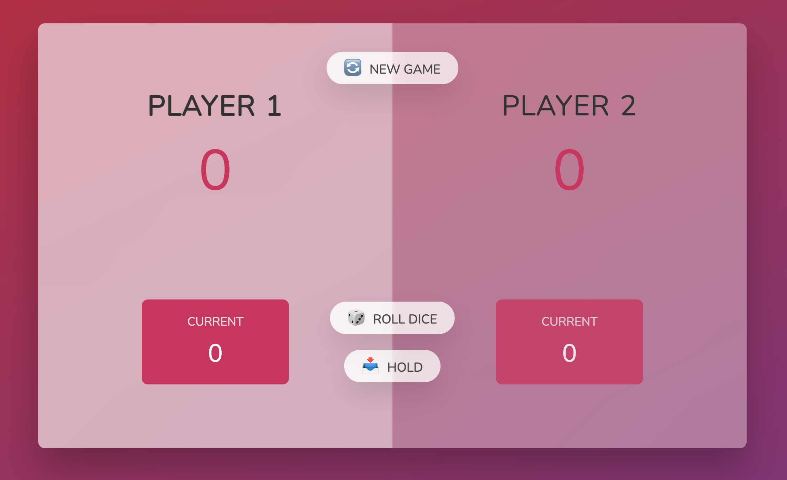

## A JavaScript game in which 2 players will try to get to a score of 100 first.

#### Project guidance by Jonas Schmedtmann

Rules:

1. Player 1 rolls first
2. Clicks the "roll dice" button and the total score will continue to add the dice value.
3. Can elect to hold at anytime to save the score value.
4. If you roll a "1" the current score value will go back to zero and it will switch to Player 2.
5. Reset the game at anytime by clicking the "New Game" button.

Tools used in this project:

- JavaScript
- CSS
- HTML
- Google Chrome
- VS Code

