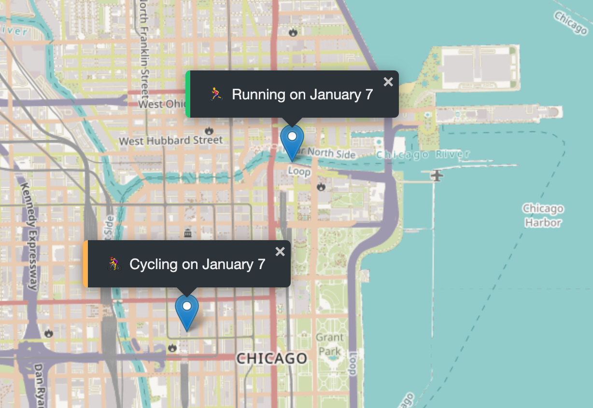

## Web App created to map my workouts on the map with metrics.

#### Project guidance by Jonas Schmedtmann

### Using GeoLocation and Local Storage - map your workout history with JavaScript!

Tools:

1. JavaScript
2. CSS
3. HTML
4. Leaflet
5. LocalStorage API
6. GeoLocation
7. VS Code
